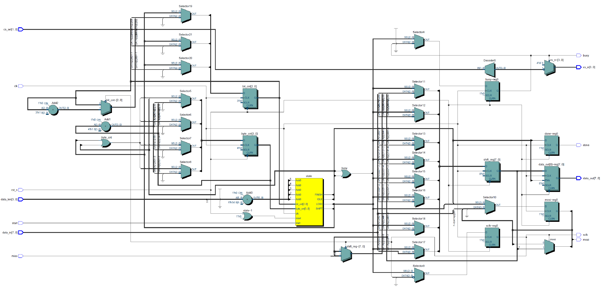
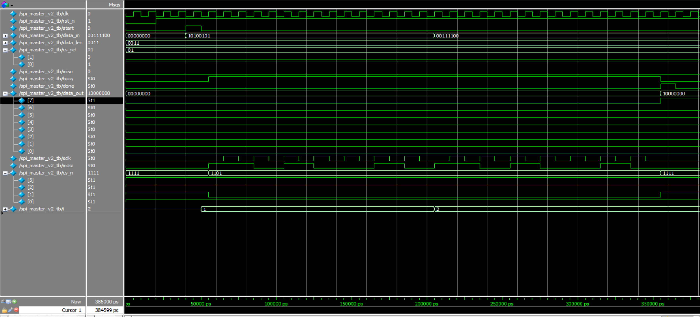

# SPI Master V2 – Verilog Implementation

## 📦 Project Overview

This project implements a Verilog-based **SPI Master Controller** that supports:

- Multi-byte transmission
- Configurable chip-select (CS) for up to 4 SPI slave devices
- FSM-driven, modular RTL design suitable for educational or practical use

> The design is verified through simulation in ModelSim and ready for further enhancements like clock division, FIFO buffering, and CPOL/CPHA support.

---

## 🔧 Key Features

- ✅ Supports both single-byte and multi-byte transfers via `data_len`
- ✅ Master generates `SCLK` and `MOSI` signals
- ✅ Selectable chip-select line through `cs_sel` (active-low)
- ✅ Provides `busy` and `done` control/status signals
- ✅ Fully testbench-driven and verified in simulation

---

## 🧱 RTL Block Diagram

---

## 📈 Simulation Waveform

### Simulation Details:

- Transmission sequence: `0xA5`, `0x3C`, `0x7E` (3 bytes total)
- MISO held at 0 → resulting `data_out = 0x80`
- `cs_n = 4'b1101` indicates CS1 active
- `done` goes high at the end of transmission

---

## 🧪 Simulation Environment

- **Tool**: ModelSim Intel FPGA Edition 10.5b
- **Testbench**: `spi_master_v2_tb.v`
- **Flow**:
  - Reset system
  - Send 3 bytes using testbench logic
  - Observe SCLK, MOSI, CS, and output verification

---

## 📁 Project Structure
spi_master_v2/
├── spi_master_v2.v # RTL design
├── spi_master_v2_tb.v # Testbench
├── RTL_spi_master_v2_basic_multi_byte.png
├── wave_spi_master_v2_basic_multi_byte.png
└── README.md

